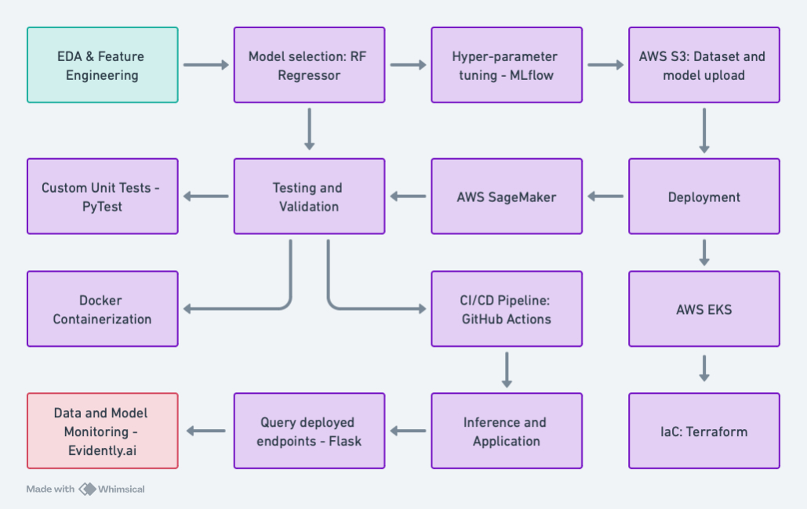

# Insurance premium pricing model

**An end-to-end machine-learning pipeline that prices health-insurance premiums from raw policyholder data, taken all the way from EDA to a containerised model served on AWS.**


Built as a Data Science intern at Course5 Intelligence (C5i) for a health-insurance client. The client's underwriters needed to quote premiums that are both accurate and profitable, which comes down to one number: the expected medical expense of each policyholder. This project takes their raw policyholder data (age, sex, BMI, children, smoker status, region) and trains a model to predict that expense, then wraps the whole thing in the tooling needed to run it in production. The client stays anonymous and the datasets are versioned with DVC rather than committed, for confidentiality.



## How it works

### Data and preprocessing (`src/preprocessing.py`)
Pulls the raw CSV from an S3 bucket, runs the EDA (feature distributions and a correlation heatmap), label-encodes the categorical features (sex, smoker, region), and writes the encoded dataset back to S3.

### Model and experiment tracking (`src/training.py`, `mlflow/train_mlflow.py`)
The model is a `RandomForestRegressor` inside a scikit-learn pipeline, scored on RMSE, R², and explained variance with 5-fold cross-validation. Every run is tracked in MLflow (parameters, metrics, and the fitted model) and the chosen model is registered in the MLflow Model Registry as `RFR-health-ins`, then exported to joblib and pushed to S3.

### Testing (`tests/`)
A PyTest suite guards the pipeline. It checks that preprocessing produces the right encoded types and can round-trip data through S3, and it holds the trained model to a performance bar: RMSE under 5000, R² above 0.8, and explained variance above 0.8. There are separate tests for preprocessing, training, and inference.

### Serving (`src/app.py`, `Dockerfile`)
A Flask app exposes the model: `/predict` takes a JSON policyholder record and returns a predicted expense, with `/ping` and `/` for health checks. It is containerised with Docker against SageMaker's expected model and input paths.

### Deployment (`src/sagemaker_training.py`, `config/eks-*.yaml`)
Training runs as a SageMaker SKLearn estimator job against the S3 train/validation splits. Serving runs two ways: on SageMaker, and on AWS EKS, where the container (from ECR) is deployed at five replicas behind a NodePort service and an ALB ingress.

### CI/CD (`.github/workflows/main.yml`)
GitHub Actions runs on every push to `main`. The first job verifies AWS credentials, installs dependencies, and runs the PyTest suite; the second job runs the deployment pipeline (preprocessing, training, inference) once the tests pass.

### Data versioning (DVC)
Datasets and model artifacts are tracked with DVC. Only the small `.dvc` pointer files live in git; the actual binaries sit in a DVC remote, which keeps the client's data out of the public repo while still versioning it.

### Inference on new data (`src/inference.py`)
Loads the registered model from S3 and scores a fresh client dataset, aligning its columns to the training schema and reporting the same RMSE, R², and explained-variance metrics. Evidently is included in the stack for data and model drift monitoring.

## Model performance

The training test gates the pipeline on the model clearing RMSE < 5000, R² > 0.8, and explained variance > 0.8 on the validation data, so a regression that degrades the model fails CI before it can ship.

## Tech stack

Python 3.8 · scikit-learn, pandas, numpy, seaborn, matplotlib · MLflow (tracking + model registry) · Flask · Docker · AWS S3, SageMaker, EKS (via boto3 and the SageMaker SDK) · DVC · PyTest · Evidently · GitHub Actions

## Repository structure

```
insurance-policy-pricing-model/
├── src/
│   ├── preprocessing.py        # S3 pull, EDA, label encoding
│   ├── training.py             # RandomForest training + CV metrics
│   ├── inference.py            # score new client data
│   ├── app.py, ping.py         # Flask serving + health checks
│   ├── sagemaker_training.py   # SageMaker SKLearn training job
│   └── wrapper.py              # runs the pipeline end to end
├── mlflow/train_mlflow.py      # MLflow tracking + model registry
├── tests/                      # PyTest: preprocessing, training, inference
├── config/                     # EKS deployment + service manifests
├── data/, models/              # DVC pointers (binaries in the DVC remote)
├── Dockerfile
├── requirements.txt
└── .github/workflows/main.yml  # CI/CD
```

## Notes

Internship project for an anonymised client; datasets are confidential and versioned via DVC, so they are not in this repo. Shared as a portfolio reference, not for reuse of the client's data or approach.
