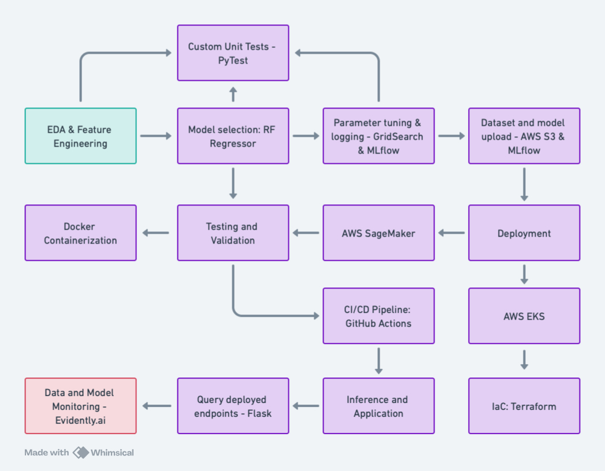

# Insurance Premium Pricing Model

This repository contains all the source code of my end-to-end data science project, right from raw data to production-level deployment using multiple AWS services. This project was assigned to me while working as a Data Science Intern at Course5 Intelligence (C5i). The name of the C5i client I carried out the project for will remain anonymous and all datasets are versioned using DVC due to conifdentiality measures. 

The client is a health insurance company and my task was to use the client's raw data containing policyholder information to create a predictive model determining the optimal 'premium' for each policyholder. The data contains a combination of numerical and categorical features, each with their own respective relationship to the target (dependent) variable: medical expense. This model is now used by the client to predict accurate expenses of future policyholders to help underwriters quote the most profitable and accurate premium based on the customers' risk profiles.

### My data pipeline is visualized above and described below

1. Conduct EDA to understand the distribution of independent features and their correlations, carry out encoding to convert categorical features to numerical.
2. Given that it is a regression problem, compare regression metrics and experiment with multiple models to filter the best performing one. 
3. Perform hyperparameter tuning using GridSearchCV and MLflow to visualize model performance.
4. Upload datasets and model artifacts to an AWS S3 bucket and deploy model on AWS EKS and SageMaker.
5. Develop custom test cases using PyTest for the preprocessing and training code to validate functionality and robustness.
6. Containerize all code using Docker and develop a Flask app in order to query endpoints for future use. 
7. Create a CI/CD pipeline using Github Actions that verifies AWS credentials, installs dependencies, and runs test cases on the code. 
8. Use the client's new data as an inference dataset and apply the packaged and trained model on the new data.
9. Monitor performance using Evidently - checking for model and data drift.
10. Clean up deployment code to mitigate the risk of any unwanted charges and document project work for the client.
